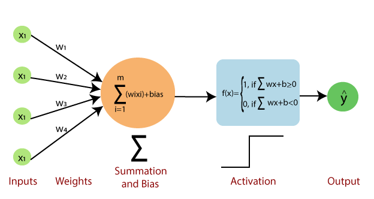
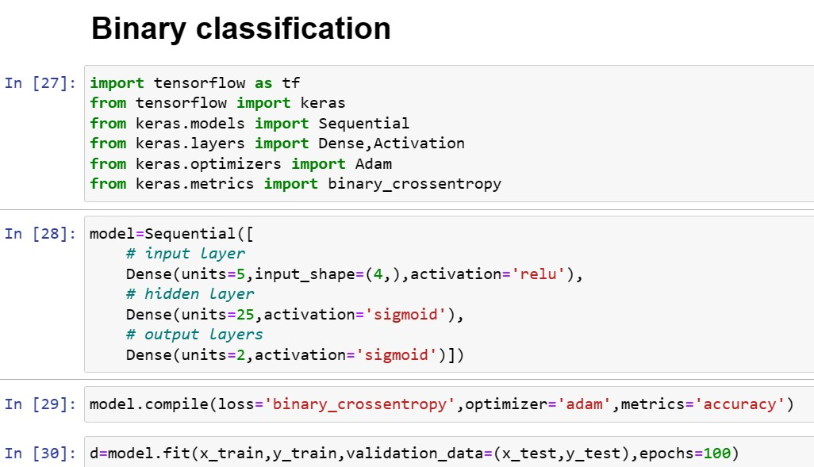
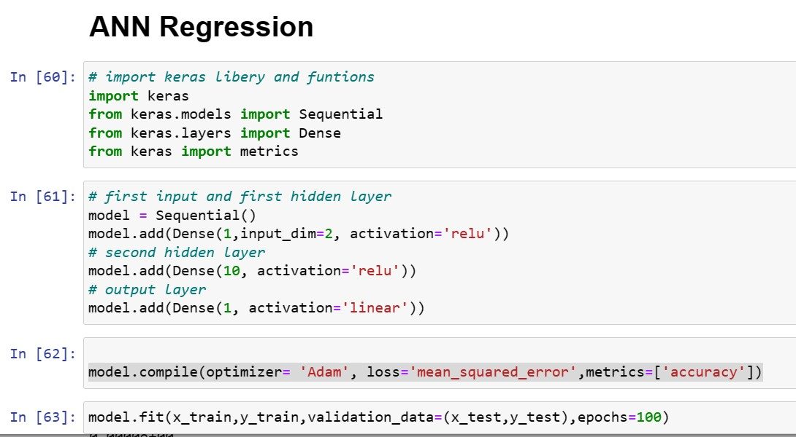
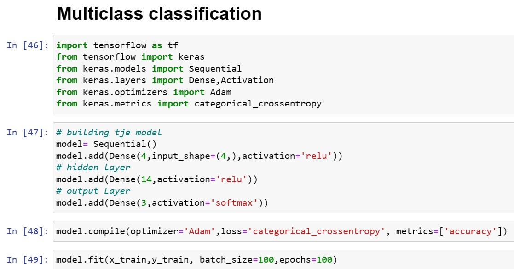

## What is AI

AI stands for "Artificial Intelligence," which refers to the development of computer systems that can perform tasks that would typically require human intelligence. These tasks include things like recognizing speech or images, making decisions, and learning from experience. AI algorithms are designed to mimic human cognitive abilities, such as reasoning, problem-solving, and perception, using mathematical and statistical methods to process large amounts of data. AI is used in a variety of applications, from chatbots and virtual assistants to self-driving cars and medical diagnosis systems

## History of AI

The history of AI can be traced back to the mid-20th century when researchers began developing computer programs that could mimic human problem-solving and decision-making. Some of the key milestones in the history of AI include:

- In 1950, computer scientist Alan Turing proposed the "Turing Test," which became a standard for determining a machine's ability to exhibit human-like intelligence.

- In the 1950s and 60s, researchers developed the first AI programs, including the Logic Theorist and the General Problem Solver.

- In the 1970s and 80s, AI research focused on developing expert systems, which were designed to provide specialized knowledge in specific fields.

- In the 1990s and 2000s, machine learning algorithms, such as neural networks and decision trees, were developed to enable computers to learn from data.

- In the 2010s and beyond, AI applications have become more widespread, including in fields such as natural language processing, image recognition, and autonomous vehicles.

Today, AI is a rapidly advancing field with the potential to revolutionize many aspects of modern life.

## Perceptron

- a single unit of logic in an ANN 

- a single node in a bigger network, meant to mimic a neuron inside a human brain

- based on mathematical  model of human brain neuron

- weighted sum = $\sum_xi*wi$

- weight = value assigned to the input that determine the impact of the input

- bias = numerical value to adjust the threshold value for neuron's activation 

- activation function = evaluates if the threshold is reached
  
  $$
  f(x)=
\begin{cases} 
1, if & \sum wx+b \geq 0 \\ 
0, if & \sum wx+b \leq 0 
\end{cases}
  $$

## Binary classification in ANN

- supervised learning model

- model is trained to predicts either true or false output

- adjusts weights and bias to minimize the error in the output

## ANN Regression

## Multiclass Classification

